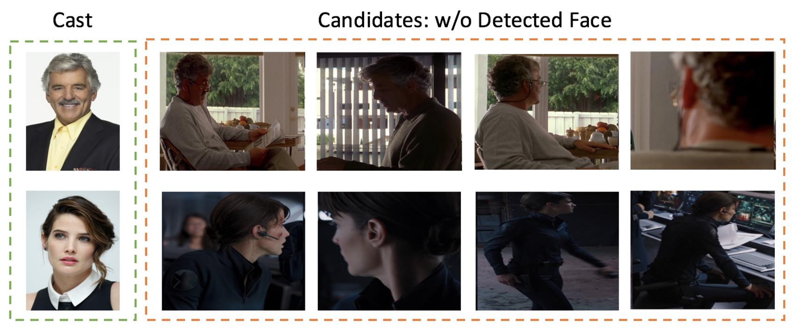
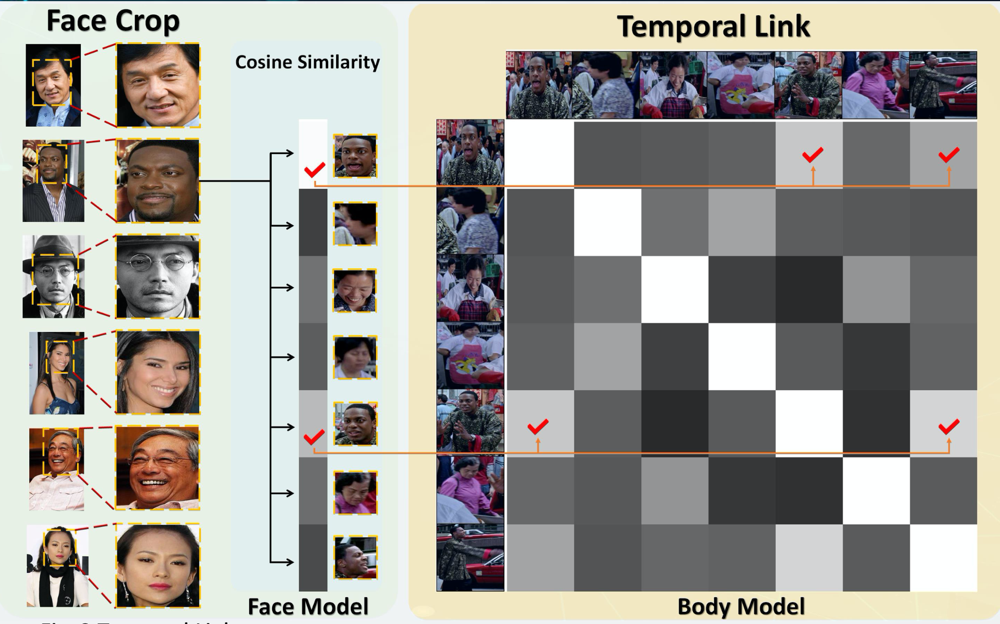

# Person Re-identification

  

  

For more details, please refer to [Face Feature Recovery via Temporal Fusion for Person Search](https://ieeexplore.ieee.org/document/9053779) to view the details.

